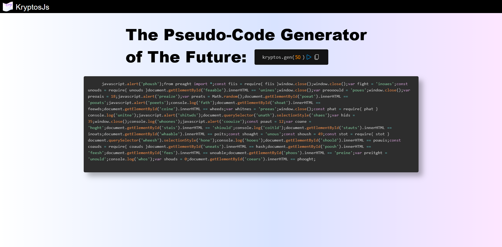

# KryptosJS
A javascript library that generates random javascript pseudo-code. [Try it here!](https://matthewzenn.github.io/KryptosJS/)
 

 
I plan to add more variety to the code and figure out a way to format it. A possible implementation for this may be in a text art generator. 
